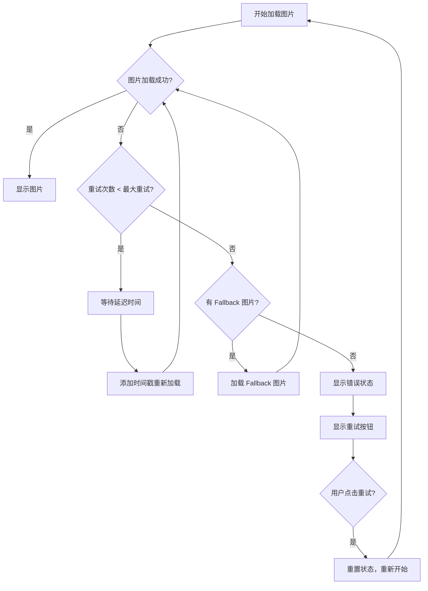

# 图片重试机制实现总结

## 概述

为商品图片展示添加了完整的重试机制，当图片加载失败时会自动重试，提升用户体验和系统稳定性。

## 实现的功能

### 1. 核心组件

#### `ImageWithRetry` 组件
- 📍 位置: `src/components/ui/ImageWithRetry.tsx`
- 🎯 功能: 带重试机制的图片组件
- ✨ 特性:
  - 自动重试（可配置次数和延迟）
  - Fallback 图片支持
  - 加载状态显示
  - 手动重试按钮
  - 类型化占位图片

#### `useImageRetry` Hook
- 📍 位置: `src/hooks/useImageRetry.ts`
- 🎯 功能: 图片重试逻辑的 React Hook
- ✨ 特性:
  - 状态管理（加载中、错误、重试中）
  - 自动重试逻辑
  - 事件回调支持
  - 日志记录

### 2. 配置系统

#### 全局配置
- 📍 位置: `src/config/imageRetryConfig.ts`
- 🎯 功能: 统一管理重试参数和 fallback 图片
- ⚙️ 配置项:
  ```typescript
  {
    maxRetries: 3,           // 最大重试次数
    retryDelay: 1500,        // 重试延迟（毫秒）
    fallbackImages: {
      furniture: '/images/placeholder-furniture.jpg',
      room: '/images/placeholder-room.jpg',
      product: '/images/placeholder-product.jpg',
    },
    enableLogging: true,     // 开发环境启用日志
  }
  ```

### 3. 已更新的组件

#### `FurnitureComparisonCard`
- ✅ 现有商品图片
- ✅ 推荐商品图片
- ✅ 单个商品图片

#### `ProductListDisplay`
- ✅ 产品列表图片
- ✅ 自定义错误占位符

#### `DesignStudio`
- ✅ 房间图片
- ✅ 家具商品图片

## 重试机制工作流程



## 使用示例

### 基本使用
```tsx
<ImageWithRetry
  src="https://example.com/image.jpg"
  alt="Product image"
  className="w-full h-full object-cover"
  fallbackType="furniture"
/>
```

### 自定义配置
```tsx
<ImageWithRetry
  src="https://example.com/image.jpg"
  alt="Custom image"
  maxRetries={5}
  retryDelay={2000}
  onRetry={(count) => console.log(`Retry ${count}`)}
  onError={(error) => console.error('Image failed:', error)}
/>
```

### 使用 Hook
```tsx
const {
  currentSrc,
  isLoading,
  hasError,
  retry
} = useImageRetry(imageUrl, {
  maxRetries: 3,
  onRetry: (count) => analytics.track('image_retry', { count })
});
```

## 性能优化

### 1. 环境适配
- **开发环境**: 启用详细日志，更多重试次数
- **生产环境**: 关闭日志，优化重试策略

### 2. 智能重试
- 添加时间戳强制刷新缓存
- 指数退避延迟（可扩展）
- 网络状态检测（可扩展）

### 3. 资源管理
- 自动清理定时器
- 组件卸载时取消请求
- 内存泄漏防护

## 监控和分析

### 日志记录
```typescript
// 开发环境自动记录
[ImageRetry] Image src updated: { src: "..." }
[ImageRetry] Starting retry: { retryCount: 1, maxRetries: 3 }
[ImageRetry] Image loaded successfully: { currentSrc: "...", retryCount: 1 }
```

### 回调事件
```typescript
<ImageWithRetry
  onRetry={(count) => {
    // 发送重试事件到分析系统
    analytics.track('image_retry', { 
      count, 
      src: imageSrc,
      component: 'ProductList'
    });
  }}
  onError={(error) => {
    // 记录错误信息
    errorReporting.captureException(error);
  }}
/>
```

## 扩展建议

### 1. 网络状态检测
```typescript
// 可以添加网络状态检测
const isOnline = navigator.onLine;
if (!isOnline) {
  // 暂停重试，等待网络恢复
}
```

### 2. 图片预加载
```typescript
// 可以添加图片预加载功能
const preloadImage = (src: string) => {
  const img = new Image();
  img.src = src;
};
```

### 3. 缓存策略
```typescript
// 可以添加本地缓存
const cachedImages = new Map<string, boolean>();
```

## 测试建议

### 1. 单元测试
- Hook 状态变化
- 重试逻辑
- 错误处理

### 2. 集成测试
- 组件渲染
- 用户交互
- 网络模拟

### 3. 性能测试
- 内存使用
- 重试频率
- 用户体验

## 总结

✅ **已完成**:
- 完整的图片重试机制
- 类型安全的配置系统
- 多个组件的集成
- 开发友好的日志系统

🚀 **效果**:
- 提升图片加载成功率
- 改善用户体验
- 减少因网络问题导致的空白图片
- 提供用户主动重试的能力

📈 **可扩展性**:
- 模块化设计，易于扩展
- 配置化管理，便于调整
- Hook 模式，可复用于其他场景